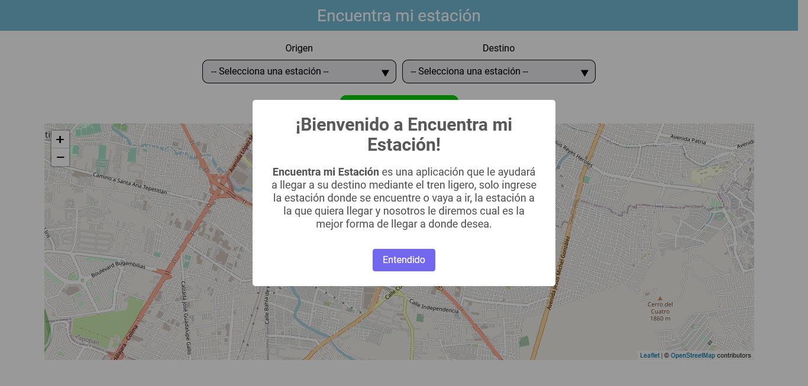
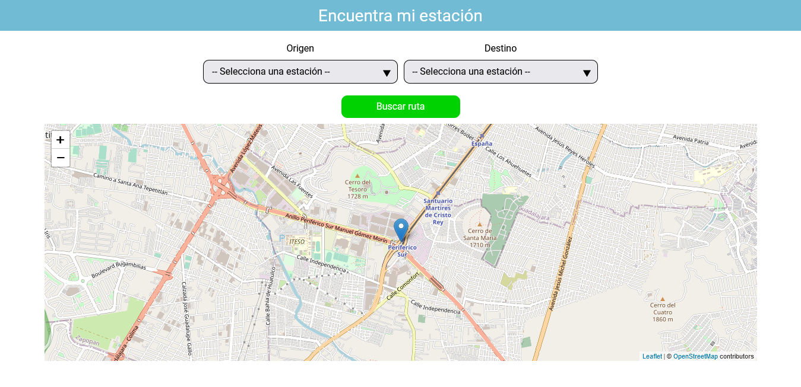
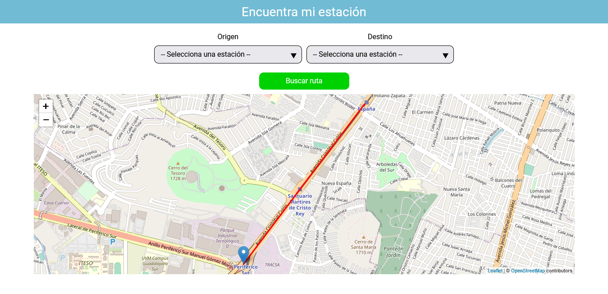

# ⚠️TRABAJO EN PROGRESO⚠️
## Encuentra Mi Estación - Frontend

Proyecto para la asignatura de Ingeniería de software 1

## Descripción del proyecto

Encuentra Mi Estación es tu guía de mano para viajar mediante el tren ligero, todo lo que necesitas hacer es seleccionar la estación en la que te encuentras, a la que quieres llegar, presionar un botón y entonces la aplicación iluminará tu senda.

## Tecnologías empleadas

Este proyecto fue desarrollado empleando las siguientes tecnologías:

- [React](https://es.reactjs.org/docs/getting-started.html), una biblioteca de Javascript para construir interfaces rápidas, complejas en poco tiempo.
- [Emotion](https://emotion.sh/docs/introduction) fue usado para crear la apariencia de la interfaz.
- [Axios](https://axios-http.com/), un cliente HTTP.
- [OpenStreetMap](https://www.openstreetmap.org), es un mapa cuya licencia es abierta.
- [Leaflet](https://leafletjs.com/), una biblioteca para crear mapas interfactivos.
- [React Leaflet](https://react-leaflet.js.org/), una versión de Leaflet especialmente hecha para ser usada en React.
- [SweetAlert2](https://sweetalert2.github.io/) para mostrar mensajes al usuario que son agradables a la vista.

## Capturas de la aplicación

Todavía no se enucuentra en un estado estable para ser desplegada, 
a continuación se muestran unas cuantas capturas del trabajo hecho hasta ahora.

Cuando la aplicación es iniciada por primera vez, se muestra un mensaje dando la bienvenida al usuario e indicando brevemente como usar la aplicación.

Una de las funcionalidades de la aplicación es que cuando el usuario elija sus estaciones origen, destino y pulse el boton "Buscar ruta",
el mapa muestre una animación de una línea roja iniciando en el origen seleccionado y pasando por cada estación hasta llegar al destino deseado por el usuario.

### Realizado por:

- Diego López Torres
- Kevin Hérnandez León
- Fernando Daniel Vera Meza
